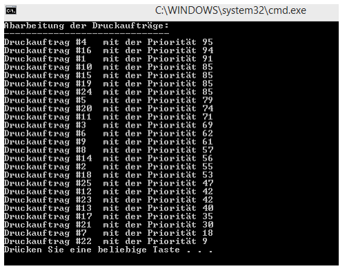

# OOP/PrintSpooler

## Lehrziele

* Erstellen von dynamischen Struktur (EVL)
* Erstellen der abstrakten Datenstruktur „Queue“
* Arbeiten mit generischen Datentypen
* Einschränken von generischen Datentypen

## Aufgabenstellung

### PrintSpooler

Schreiben Sie ein Programm, welches Druckaufträge in einer Queue verwaltet. Grundsätzlich gilt, der
erste Auftrag der in die Queue eingefügt wird, wird auch als erster abgearbeitet. Allerdings werden
den Druckaufträgen Prioritäten zugeordnet. Aufträge mit höherer Priorität werden den anderen
Aufträgen mit niedrigeren Prioritäten vorgereiht. Innerhalb der Priorität gilt das FiFo-Prinzip (First In
First Out).

Beispiel:

> **Hinweis**
Zum Beispiel: Die Nummer ist die Reihenfolge, mit der der Druckauftrag in den PrintSpooler engefügt
worden ist.

### Erweiterte Anforderungen für Spezialisten

* keine

### Testdokumentation

Testen Sie das Programm nach eigenen Überlegungen und überprüfen Sie die Ergebnisse!

### Abgabe

* Termin 1 Woche nach Ausgabe der Übung (wenn nicht anders angegeben)
* Projektname PrintSpooler.ConApp
* Format: zip-Format
* Ort Moodle/Kurs - Programmieren

Viel Erfolg

